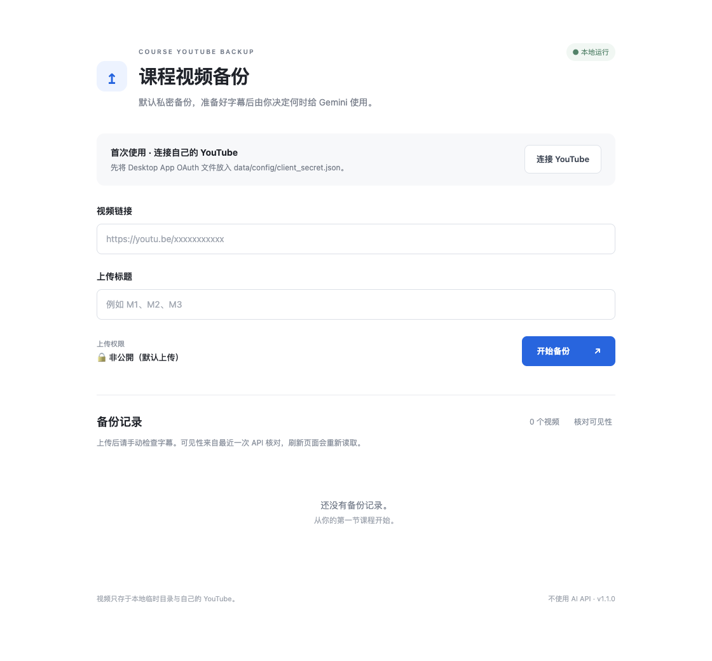

# Course YouTube Backup · 课程视频备份工具

在自己的 Mac 上备份获准保存的 YouTube 课程视频：输入链接和 **自己指定的标题** → 下载 → 上传到自己的 **Private** YouTube → 成功后删除临时视频 → 手动检查 YouTube 自动字幕 → 确认后临时公开供 Gemini 使用 → 一键恢复 Private。字幕导出和复制保留为辅助功能。



**主程序只在 `http://localhost:8000` 本地运行。** GitHub Pages 是介绍和下载入口，没有 Python 后端，不会下载视频、上传 YouTube 或处理 OAuth。本项目没有视频处理服务器，不使用任何 AI API。

> 必须取得视频所有者的备份与上传许可；可观看链接不一定意味着允许重新上传。本工具不提供登录保护、Private 视频权限、DRM 或付费墙的绕过。
>
> YouTube 不保证生成自动字幕。`captions.list` / `captions.download` 也可能受权限限制；没有凭据时只能验证 mock 行为，不能保证你的频道能通过 API 取得 ASR。工具会显示未就绪或真实 API 错误，并提供 YouTube Studio 字幕入口，不会伪造“字幕完成”。

## 功能

- yt-dlp 当前稳定版 + ffmpeg 合并音视频，最高 1080p，无 4K / 8K。
- 只接受单个 YouTube 视频 URL；播放列表参数被去掉，直播需结束后再备份。
- 上传标题必须手动输入，原视频标题仅作为确认信息。
- 上传始终使用后端常量 `YOUTUBE_PRIVACY = "private"`；上传接口拒绝额外权限参数。自动字幕就绪后可在独立区域明确确认临时公开，使用完手动恢复。
- Google Desktop OAuth，token 和 client secret 仅在本机保存，目录 0700 / token 0600。
- YouTube 官方 resumable upload，8 MiB 分块；按服务器确认的字节显示进度。
- 本机保存上传会话，重试和重启后先查询 YouTube 上传状态，继续传输剩余字节。
- 上传确认返回 Video ID 和 private 后记录历史，再删除临时视频。失败保留文件，支持重试。
- 手动字幕检查，优先日语 ASR，次选其他语言 ASR；兼容 API 实际返回的小写 `asr` 和大写 `ASR`，优先日语 BCP-47 标签；拒绝明确标记为 syncing / failed 或草稿的轨道。
- `captions.download(tfmt="srt")`，保存 SRT 和去标签的 TXT，可一键复制。
- Gemini 使用：确认后公开、复制短链接、一键恢复 Private；历史显示 YouTube API 实际核对的可见性。
- 每条历史可仅删除本地数据；成功上传的视频还可二次危险确认后删除 YouTube 视频，API 失败保留记录。
- SQLite 历史，刷新浏览器或重启不丢失已保存记录。

## macOS 环境与首次安装

需要 macOS、Python **3.10+**、ffmpeg / ffprobe、Deno（推荐）或 Node。需要网络连接、可用 YouTube 频道，以及足够容纳一个课程视频的磁盘空间。长于 15 分钟的上传可能需要先在 YouTube 完成频道验证。

1. 如果没有 Homebrew，从 [brew.sh](https://brew.sh/) 按官方步骤安装。
2. 在 Terminal 执行：

   ```sh
   brew install python ffmpeg deno
   ```

   新版 yt-dlp 的完整 YouTube 支持需要外部 JavaScript 运行时；Python 安装已包含 `yt-dlp-ejs`，不需要 npm 项目。
3. 下载本项目 Release ZIP 并解压，或 clone GitHub 仓库。
4. 进入解压后的文件夹，运行：

   ```sh
   chmod +x start.command
   ./start.command
   ```

首次启动自动创建 `.venv` 并安装 Python 依赖；以后双击 `start.command` 即可。启动器仅监听 `127.0.0.1:8000`，自动打开默认浏览器。保持 Terminal 打开；停止时按 **Control+C**。若 Finder 未允许执行脚本，可在 Terminal 运行上述命令。

也可手动安装：

```sh
python3 -m venv .venv
.venv/bin/python -m pip install -r requirements.txt
.venv/bin/python -m app.launcher
```

## Google Cloud Console：你本人需要完成的步骤

只需配置 API 与 OAuth，不需要部署服务器，也不需要购买 AI 服务。Google 界面名称可能随语言略有不同。

1. 打开 [Google Cloud Console](https://console.cloud.google.com/)，用自己的 Google 账号登录，创建一个项目，例如 `Course Backup`。
2. 打开 **APIs & Services / API 和服务 → Library / 库**，搜索 **YouTube Data API v3**，点击 **Enable / 启用**。
3. 打开 **Google Auth Platform**（或 **OAuth consent screen / OAuth 同意屏幕**）。设置应用名，例如 `Course Backup`，以及自己的支持 / 联系邮箱。
4. **Audience / 目标对象** 选择 **External / 外部**；保持 **Testing / 测试**，在 **Test users / 测试用户** 加入你实际登录 YouTube 的 Google 邮箱。只供自己使用，无需多用户系统。
5. **Data Access / 数据访问** 添加这两个 scope：
   - `https://www.googleapis.com/auth/youtube.upload`
   - `https://www.googleapis.com/auth/youtube.force-ssl`

   字幕管理需要 `youtube.force-ssl`。Google 会显示它允许管理 YouTube 数据，本程序调用上传、字幕列表/下载、视频状态读取，以及你明确操作后的隐私修改/视频删除。不会自动公开或自动删除 YouTube 视频。
6. 在 **Clients / 客户端 → Create client / 创建客户端**（或 **Credentials / 凭据 → Create credentials → OAuth client ID**），类型选择 **Desktop app / 桌面应用**，不要选择 Web Application，不需要填写公网回调 URL。
7. 下载 OAuth JSON，重命名为 **client_secret.json**，放到项目中的：

   ```text
   data/config/client_secret.json
   ```

   启动程序时会自动创建这个目录；不要把假示例文件当真实凭据使用，不要把凭据贴到 GitHub。
8. 打开本地页面，点击 **连接 YouTube**。默认浏览器会尝试打开 Google 授权页；若没有打开，直接点击页面上的 **打开 Google 授权页面**，也可以点击 **复制授权链接** 并在浏览器中粘贴打开。链接生成后始终显示，约 5 分钟内有效，授权完成或超时后自动移除；请勿分享此临时链接。缺少或无效的 OAuth 文件会立即显示具体错误。选择自己的频道所属 Google 账号并确认授权。若显示测试应用未验证提示，先确认项目是你自己创建且测试用户正确。
9. 授权成功后 token 保存到 `data/config/token.json`。以后通常自动刷新；被撤销或过期时点击 **重新授权**。

**测试模式注意：** 带 YouTube scopes 的外部测试应用 refresh token 通常 7 天过期，届时需重新授权。要减少重复授权，可在了解 Google 要求后将 OAuth Audience 改为 Production；这可能仍显示未验证警告，是否需要验证取决于 Google 的策略。见 [OAuth refresh token expiration](https://developers.google.com/identity/protocols/oauth2#expiration)。

如果使用品牌频道，请确认授权时选择了实际用于备份的 YouTube 频道。Private 视频和字幕 API 都依赖正确的频道所有权。

## 日常使用

1. 双击 `start.command`，自动打开 `http://localhost:8000`。
2. 粘贴老师提供且允许备份的单个课程链接。
3. **手动**填写标题，例如 `M1`。不会自动填入原视频标题。
4. 点击 **开始备份**。同一时间只处理一个任务，防止大文件并发占用资源。
5. 下载完成后自动上传。显示的上传百分比来源于 YouTube 已确认接收的字节；最后确认成功才达到 100%。
6. 成功后显示 YouTube 链接、非公開状态，并删除临时视频；字幕不会立即完成。
7. 等待后点击 **检查字幕**。不会自动调用字幕 API，重复手动检查至少间隔 60 秒。
8. 找到日语 ASR 时显示日本語；没有日语但有其他可用 ASR 时显示实际语言。
9. 自动字幕就绪后，在 **Gemini 使用** 中点击 **临时设为公开**，阅读公开可访问的警告并确认。只有 API 返回 Public 才显示公开状态和 **复制 Gemini 用链接**。
10. 复制 `https://youtu.be/<videoId>` 给 Gemini。使用结束点击 **恢复为非公开**，API 确认 Private 后显示非公開。
11. 如需本地字幕，展开 **字幕文件（辅助功能）**，获取字幕后复制或下载 TXT / SRT。

字幕检查不是无限等待任务：API 返回空数组时明确显示「API 尚未同步」，不会据此断言 Studio 的字幕尚未生成；已经返回 ASR 但轨道不可获取时显示实际状态。几小时后仍没有时，请进入 YouTube Studio 检查视频语言、处理状态和自动字幕。清晰音频和正确语言有助于 YouTube 生成；生成由 YouTube 决定，本工具不能强制。

官方 API 返回 403 时，不会改用爬虫绕过私密字幕权限。点击 **YouTube Studio**，在该视频字幕页面确认自动字幕是否存在，并使用 Studio 可用的下载操作。官方 [`captions.download`](https://developers.google.com/youtube/v3/docs/captions/download) 要求编辑视频权限；自动轨道可见不代表一定能成功下载。

## Gemini 使用与可见性

默认 Private；没有上传完成或没有可用 ASR 的视频不提供公开按钮。公开必须逐次确认，没有自动公开、定时公开或后台修改隐私。**Public 会一直保持，直到你主动恢复**；关闭程序不会自动恢复。

隐私修改采用官方 [`videos.update(part="status")`](https://developers.google.com/youtube/v3/docs/videos/update)，保留可修改的其他状态字段，使用 ETag 防止覆盖并发修改，不创建定时发布。显示依据 API 返回的 `privacyStatus`，不先改 UI。响应丢失时只读取状态进行核对；无法核对时显示「待确认」，保留上次状态，不假定 Private。重启后先标记待确认，页面连接后只读核对一次；也可点击「核对可见性」。状态旁标注 API 确认时间，在 Studio 修改后应再次核对。

Google 对未审核 API 项目或频道可能限制公开视频。错误会显示在页面，实际可见性保持以 API 核对结果为准。Public 链接是否能被 Gemini 读取仍取决于 Gemini 本身的支持及访问限制；本工具不调用 Gemini API。

## 删除备份记录

每条记录右侧的 **删除** 均先确认，不针对某个标题设置规则。

- 未完成上传、没有有效 Video ID 或被 API 确认为孤立记录：只显示「删除这条本地记录？」和「删除记录」。清理该任务自己的历史、TXT/SRT 与临时目录。
- 成功上传且有有效 Video ID：可选 **仅删除本地记录**，YouTube 上的视频保持不变；或 **删除 YouTube 视频和本地记录**。
- 删除 YouTube 视频需要第二次危险确认，显示标题并要求输入完整标题。官方 [`videos.delete`](https://developers.google.com/youtube/v3/docs/videos/delete) 确认 HTTP 204 后才删除本地数据；API 拒绝或响应不确定时保留本地记录与文件。
- 远端删除成功但本地清理失败时，记录保留「YouTube 已删除」标记，可重试仅删除本地记录，不再次删除远端。
- 进行中的任务暂不可删除。删除一条记录不会删除其他任务目录；仅删本地记录后无法从该工具恢复这条记录。

API 核对发现视频不存在或远端上传失败时统一标为孤立记录，不自动删除。远端未找到也可能表示当前授权频道无法访问该视频，请核对账号后决定是否删除本地记录。

## 本地文件

```text
app/                         Python 后端 + 原生 HTML/CSS/JS
app/static/                  中文本地应用
start.command                macOS 双击入口
requirements.txt             主程序依赖
requirements-lock.txt        开发时实际验证的依赖快照
client_secret.example.json   假占位配置，不能用于登录
data/config/                 client_secret.json、token.json（仅本机）
data/temp/<任务ID>/           临时视频与分片（仅本机）
data/history/history.sqlite3 SQLite 历史与上传会话（仅本机）
data/subtitles/<任务ID>/M1.srt
data/subtitles/<任务ID>/M1.txt
docs/                        GitHub Pages 静态介绍网站
tests/                       不含个人数据的 mock 测试
scripts/                     安全扫描、ZIP 打包和发布工具
```

同名标题保存到不同任务目录，避免 `M1` 覆盖旧字幕；下载文件仍叫 `M1.srt` / `M1.txt`。标题中的文件名非法字符只影响保存文件名，不改变上传标题。历史包含自定义标题、原始视频链接、Video ID、上传时间、状态、字幕语言与路径。

上传失败保留完整视频和上传会话；**重试备份 / 上传** 会尽量直接继续上传。下载失败时也保留 `.part` 以便 yt-dlp 恢复。上传会话过期时必须先确认频道没有重复视频，再点击重新上传（从头开始）。重启中断的任务会显示失败，供手动恢复。正常上传后清理失败则显示 **清理临时文件**。

不要在备份进行中移走视频文件。关闭 Terminal 会中断任务；下次启动可手动重试。token、数据库和上传会话是敏感信息，不要分享整个 `data/`。

## 常见错误

| 情况 | 处理方法 |
|---|---|
| URL 无效 / 标题为空 | 使用单个 YouTube 视频链接，输入 1–100 字的标题 |
| 不存在、Private、需要登录或付费的视频 | 确认链接与权限；本版不读取浏览器 cookies，不绕过访问限制 |
| yt-dlp 提取或下载失败 | 检查网络；运行 `.venv/bin/python -m pip install -U "yt-dlp[default]"` 更新稳定版 |
| ffmpeg / ffprobe 缺失 | `brew install ffmpeg` |
| JavaScript 运行时缺失 | `brew install deno`，或使用已安装的 Node |
| OAuth access_denied | 将实际账号加入 OAuth 测试用户，确认 Desktop App 客户端 |
| Token 过期、被撤销、invalid_grant | 点击重新授权，完成 Google 登录 |
| API 未启用 / 权限不足 | 确认 YouTube Data API v3、正确频道、两个 scopes，并重新授权 |
| 上传失败 / 网络中断 | 文件已保留，点击重试；有会话时先探测远端进度 |
| 上传会话过期 | 在 Studio 确认没有重复视频后重新上传 |
| 配额用完 / 上传额度限制 | 查看 Cloud Console API Quotas；停止重复调用，等额度恢复 |
| 自动字幕未生成 | 稍后手动检查；YouTube 也可能不生成，请在 Studio 确认 |
| 没有日语字幕 | 使用实际检测到的其他语言 ASR，不自动翻译 |
| 字幕 API 403 | 确认编辑视频权限；使用 Studio 可用的字幕下载方式 |
| 临时文件删除失败 | 检查权限和磁盘后点击清理，或退出应用后清理该任务目录 |
| 端口 8000 占用 | 同一应用已启动时自动打开原页面；其他程序占用时会给出提示 |
| 历史数据库损坏 | 退出，备份 `data/history`，移走损坏数据库后重启；不自动覆盖原文件 |
| 剪贴板失败 | 使用下载 TXT，打开文件自行复制 |

[`captions.list`](https://developers.google.com/youtube/v3/docs/captions/list) 每次 50 单位，[`captions.download`](https://developers.google.com/youtube/v3/docs/captions/download) 每次 200 单位；配额规则可能变化，以 Console 和官方文档为准。页面的 2 秒刷新只读取本机状态；每次新页面连接后另外进行一次只读视频状态核对，手动「核对可见性」也读取 YouTube。字幕检查和隐私/删除操作均由你手动触发。

## 隐私与安全

- 不存在开发者视频服务器。主程序仅连接 YouTube / Google 与视频下载源。
- 仅监听 loopback，不开放公网；Host / Origin 验证、跨站请求阻止和本地写入 token 防止网页触发上传。
- 上传权限来自后端常量，额外前端字段被拒绝。公开需明确确认，远端删除需二次确认；API 异常显示核对后的状态或待确认。
- token 文件写入采用临时文件替换和 0600 权限；这不是文件内容加密，请保护本机账号。
- 日志不记录 OAuth token、上传会话 URL 或老师的原链接。
- `.gitignore` 排除整个 `data/`、OAuth、`.env`、视频、字幕、数据库、虚拟环境与缓存。
- 发布脚本扫描 Git index 和历史，再按追踪文件打包，ZIP 不包含 `.venv` 或个人数据。
- 如果真实凭据曾进入 commit，不要只加 ignore：移除 Git 历史并在 Google 撤销 / 重新生成凭据。
- 不使用 AI API，不做摘要或作业回答；由你自行将公开视频链接或字幕用于 Gemini 等工具。

## 测试与开发

```sh
.venv/bin/python -m pip install -r requirements-dev.txt
.venv/bin/python -m pytest -q
```

测试使用临时目录与合成数据，不下载真实课程、不调用 Google、不上传任何视频。OAuth 回归测试实际启动本地回调监听器；Google token 响应由测试模拟。覆盖 URL / 标题、固定 private、断点续传和网络异常、成功清理 / 失败保留、历史恢复 / 损坏、ASR 选择、字幕转换与导出、本地访问保护、隐私变更成功/拒绝/响应丢失、无 ID / 仅本地 / 远端删除成功与失败，以及 Git / ZIP 安全扫描。

`.venv/bin/python scripts/verify_oauth_ui.py` 可用真实 Chrome 验证自动打开失败后的手动按钮、复制链接、真实本地回调，以及拒绝 / 超时清理；Google 页面和 token 响应均为合成数据。

UI 验证：`.venv/bin/python scripts/verify_ui.py`（需要安装 Chrome 或 `python -m playwright install chromium`）。测试截图由无凭据的新本地实例生成，使用合成 UI 场景，不包含个人课程。

`.venv/bin/python scripts/verify_gemini_ui.py` 使用真实 Chrome 和隔离数据库，验证公开确认、复制 Gemini 链接、恢复、两级删除确认及失败保留；所有 YouTube 状态与写操作使用合成数据。

## GitHub / Pages / Release

<!-- PUBLIC_LINKS_START -->
- [GitHub Repository](https://github.com/mahirun019-dev/course-youtube-backup)
- [GitHub Pages 介绍网站](https://mahirun019-dev.github.io/course-youtube-backup/)
- [v1.1.0 Release](https://github.com/mahirun019-dev/course-youtube-backup/releases/tag/v1.1.0)
<!-- PUBLIC_LINKS_END -->

介绍页面源码在 `docs/`，可直接用 GitHub Pages 的 **Deploy from a branch → main → /docs**。无需 GitHub Actions 或公网后端。

已登录 GitHub 后，一次性发布：

```sh
gh auth login -h github.com
.venv/bin/python scripts/publish.py
```

发布脚本默认创建 Public `course-youtube-backup` 仓库，提交源码，push，设置 `/docs` Pages，按 `app/config.py` 的 VERSION 创建对应 Release 并上传安全 ZIP。若仓库名称已存在且不是当前仓库的 remote，会停止，避免覆盖他人或已有项目。对已完成的发布可重复运行，跳过已存在的 Release。

只打包：

```sh
.venv/bin/python scripts/safety.py
.venv/bin/python scripts/package.py
```

Release ZIP 位于项目父目录，只包含 Git 跟踪的运行源码、文档和测试。`start.command` 在 ZIP 内带可执行权限；解压工具若未保留权限，请运行 `chmod +x start.command`。

## 参考与许可证

MIT，见 [LICENSE](LICENSE)。下载功能依赖 [yt-dlp](https://github.com/yt-dlp/yt-dlp)；上传使用 [YouTube resumable upload 官方协议](https://developers.google.com/youtube/v3/guides/using_resumable_upload_protocol)，OAuth 使用 [Desktop loopback redirect](https://developers.google.com/identity/protocols/oauth2/native-app)。GitHub Pages 只托管静态内容，见 [GitHub Pages 官方说明](https://docs.github.com/en/pages/getting-started-with-github-pages/what-is-github-pages)。


临时字幕诊断：`COURSE_CAPTION_DEBUG=1 ./start.command`。每次手动检查字幕时，脱敏 metadata 记录到 `data/history/captions-diagnostic.log`，仅包含哈希化 ID、trackKind、语言、状态等白名单字段，不记录 token、credentials、字幕文本或字幕名称。退出后普通启动即关闭诊断；日志不进入 Git 或 Release。
